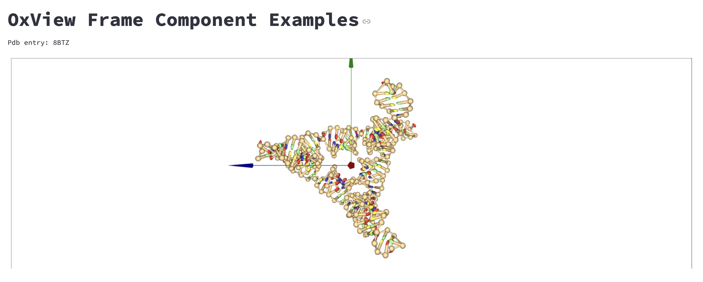

# Streamlit Oxview Component

A Streamlit component for the display of coarse-grained DNA/RNA 3D models.

This is a simple component that renders coarse-grained DNA/RNA 3D models. It is a wrapper around the [oxdna-viewer](https://github.com/sulcgroup/oxdna-viewer.git).

## Installation

**This component requires access to write files to the disk.**

**To use this component in your Streamlit app, download the repository and insert the folder `st_oxview_component` into your project.**

## Example



Look at the [example](https://stoxview.streamlit.app/) for a simple example:

[](https://stoxview.streamlit.app/)

## Usage

### Display from file paths

```
import streamlit as st
from st_oxview_component import oxview_from_file

success = oxview_from_file(configuration=path_to_conf, # path to the configuration file
                           topology=path_to_topo,      # path to the topology file
                           forces=None,                # path to the forces file
                           pdb=None,                   # path to the pdb file
                           width='99%',                # width of the viewer frame
                           height='500',               # height of the viewer frame
                           key=None)                   # streamlit component key

```

### Display from text

```
import streamlit as st
from st_oxview import oxview_from_text

with open("configuration.dat", "r") as f:
    conf_text = f.read()

with open("topology.top", "r") as f:
    topo_text = f.read()

success = oxview_from_file(configuration=conf_text, # text of the configuration file
                           topology=topo_text,      # text of the topology file
                           forces=None,             # text of the forces file
                           pdb=None,                # text of the pdb file
                           width='99%',             # width of the viewer frame
                           height='500',            # height of the viewer frame
                           key=None)                # streamlit component key


```

The functions return a boolean value indicating if the program was able to write and read the files.

## How to cite:

Please include this citation if the OxView Component is used in an academic study:

```
Lucandia. Lucandia/st_oxview; Zenodo, 2024. https://zenodo.org/doi/10.5281/zenodo.12515559.
```

[](https://zenodo.org/doi/10.5281/zenodo.12515559)


## License

Code is licensed under the GNU General Public License v3.0 ([GPL-3.0](https://www.gnu.org/licenses/gpl-3.0.en.html))

[](https://www.gnu.org/licenses/gpl-3.0.en.html)
